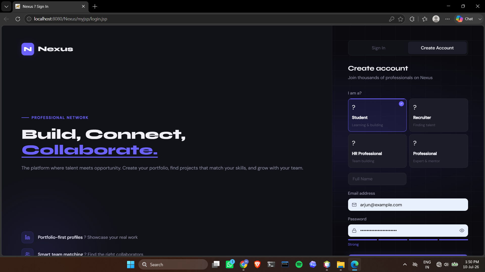
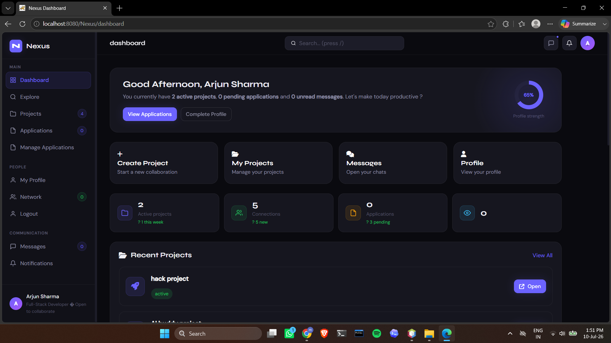
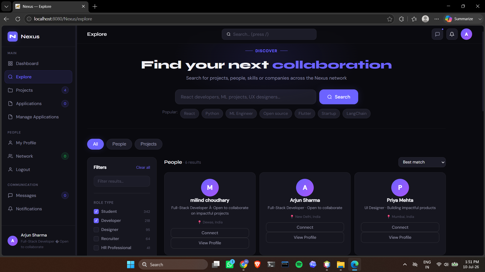
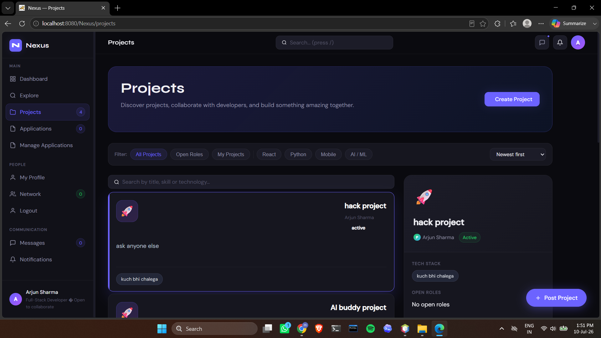
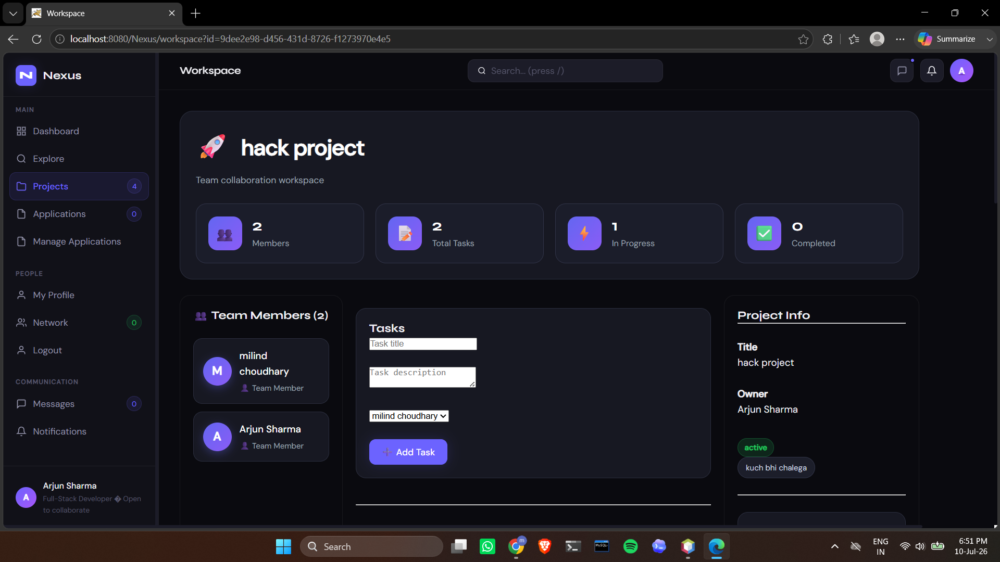
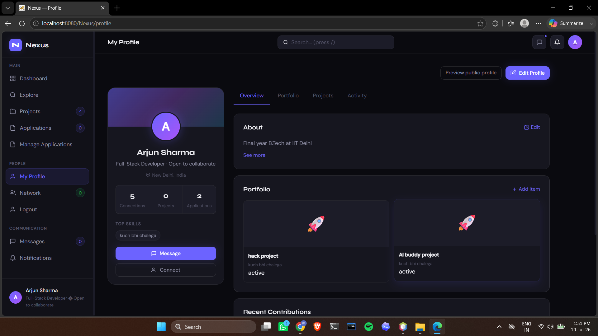
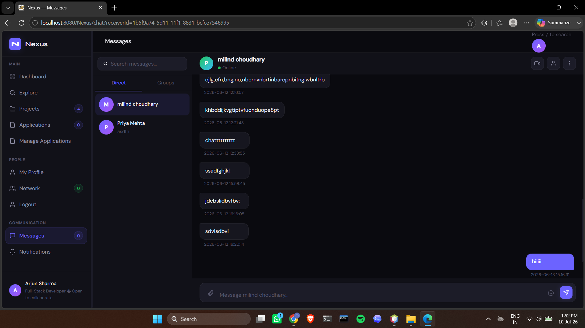
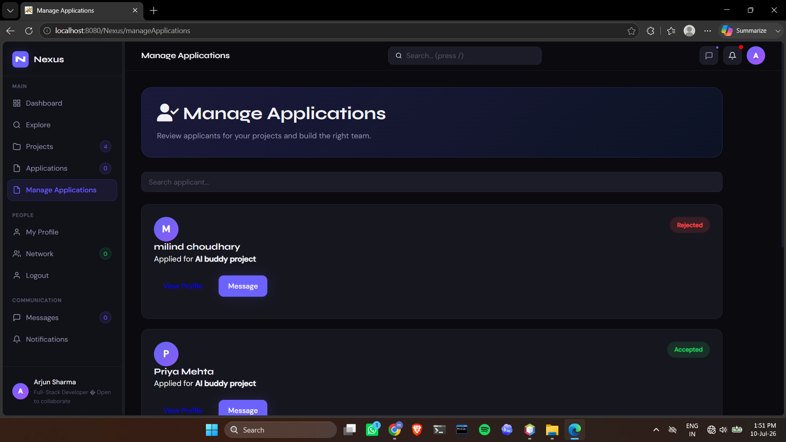
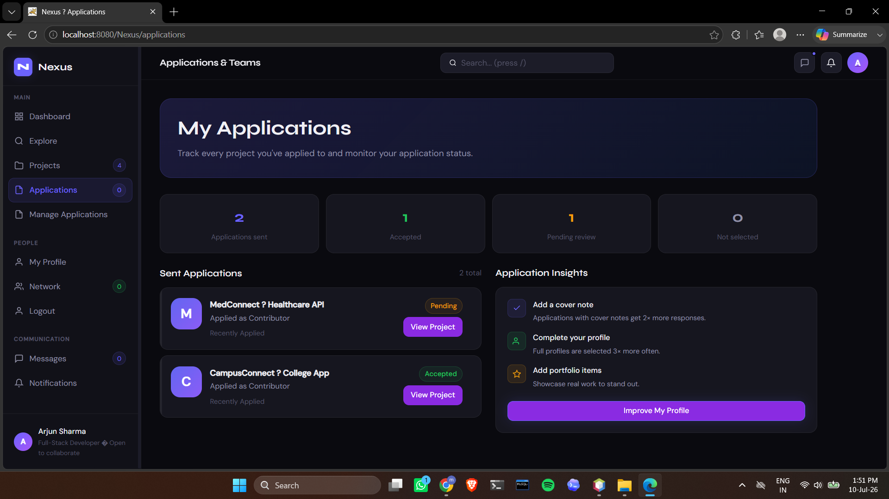
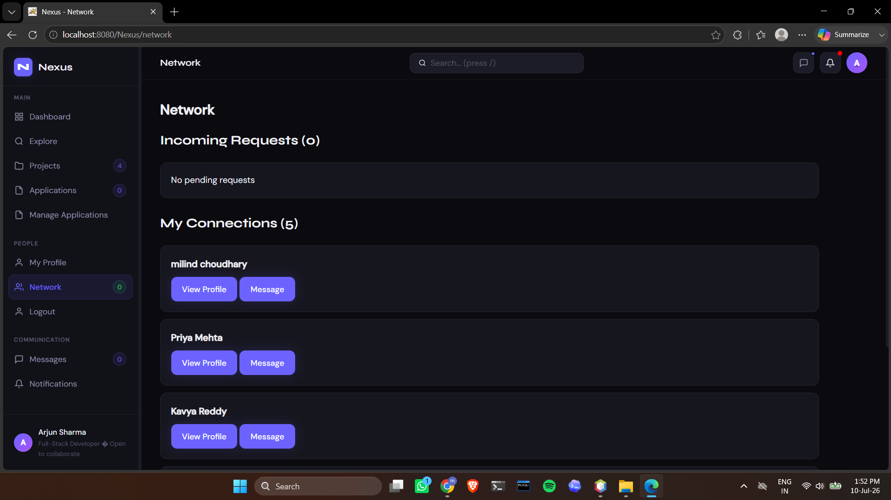

# Nexus - Networking & Collaboration Platform

A full-stack networking and collaboration platform that helps students and developers connect, collaborate on projects, build teams, manage applications, and communicate through real-time messaging.

---

## Features

### Authentication
- User Registration
- Secure Login
- Session Management
- Logout

### User Profiles
- Edit Profile
- Bio & Headline
- Location
- Public Profile View
- Dynamic User Information

### Networking
- Send Connection Requests
- Accept / Reject Requests
- View Connections

### Project Management
- Create Projects
- Edit Projects
- Delete Projects
- Project Details Page
- Project Roles
- Team Members
- Project Applications

### Applications
- Apply to Projects
- Track Application Status
- Manage Incoming Applications
- Accept / Reject Applicants

### Team Collaboration
- Team Members
- Workspace
- Tasks
- Project Discussions

### Messaging
- Personal Chat
- Group Chat
- Chat History

### Notifications
- Notification Center
- Notification Dropdown
- Real-time Notification Count

### Dashboard
- Personalized Dashboard
- Recent Projects
- Recent Activities

---

## Tech Stack

### Backend
- Java
- Java Servlets
- JSP

### Frontend
- HTML5
- CSS3
- JavaScript

### Database
- MySQL

### Server
- Apache Tomcat

### Build Tool
- Maven

---

## Project Structure

```
src/
 ├── main/
 │   ├── java/
 │   ├── resources/
 │   └── webapp/
 └── test/
```

---

## Installation

### Clone Repository

```bash
git clone https://github.com/Milind04-ai/Networking-and-collbrating-platform.git
```

### Open Project

Open the project in NetBeans.

### Configure Database

Create

```
src/main/resources/db.properties
```

Example:

```properties
db.url=jdbc:mysql://localhost:3306/nexus
db.user=root
db.password=your_password
```

### Run

- Start MySQL
- Start Apache Tomcat
- Build the project
- Run on server

---

## Screenshots

### Login


---

### Register



---

### Dashboard



---

### Explore Projects



---

### Project Details



---

### Workspace



---

### User Profile



---

### Chat



---

### Manage Applications



---

### My Applications



---

### Network



---

## Future Improvements

- Email Verification
- Password Reset
- Profile Picture Upload
- File Sharing
- Video Calling
- Better Search Filters
- Mobile Responsive Design
- Admin Dashboard

---

## Author

**Milind Choudhary**

GitHub:
https://github.com/Milind04-ai

---

## License

This project is developed for educational and learning purposes.
